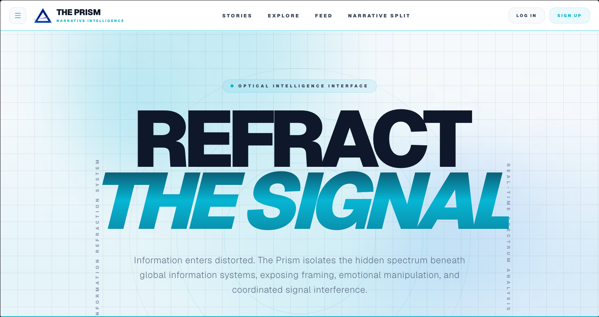
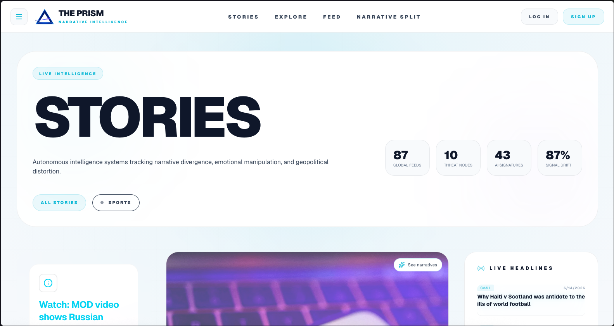
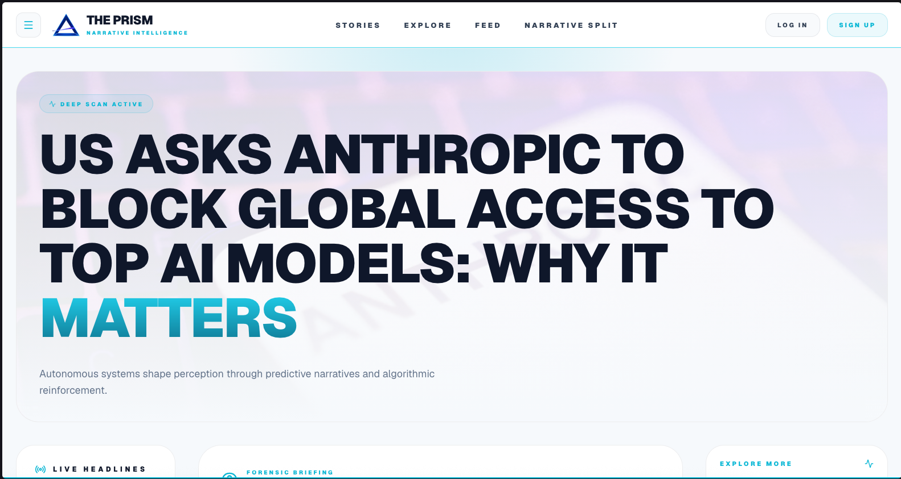
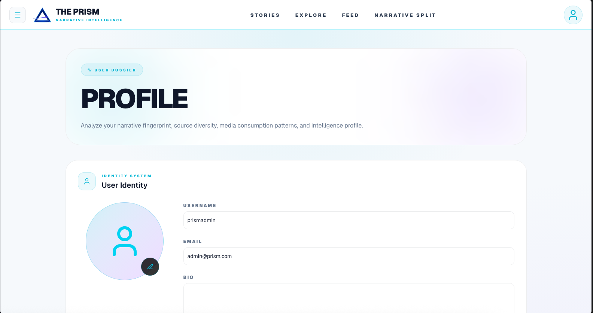
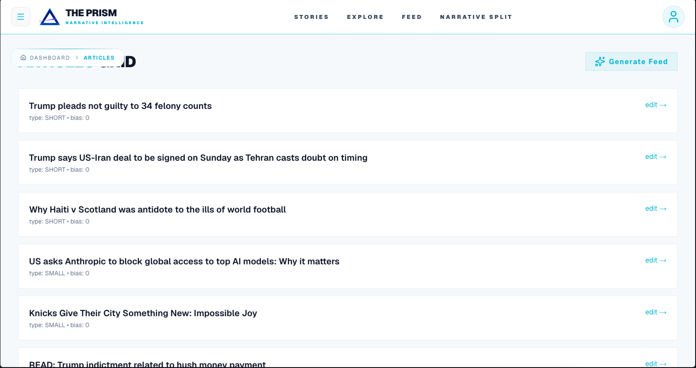

# 🔮 The Prism

> A modern news platform built for discovering, reading, and sharing stories.



## ✨ Features

- 📰 Browse the latest articles
- 🔍 Search and discover stories
- 👤 User authentication
- 🖼️ Profile customization with avatars
- ❤️ Like and interact with content
- 📱 Responsive design for desktop and mobile
- ⚡ Fast performance powered by Next.js
- 🔒 Secure backend and database integration

---

## 📸 Screenshots

### Home Page


### Article Page


### Profile Page


### Create Article


---

## 🛠️ Tech Stack

### Frontend
- Next.js
- React
- TypeScript
- Tailwind CSS

### Backend
- Fastify
- TypeScript

### Database
- PostgreSQL
- Neon

### Authentication
- JWT Authentication

### Deployment
- Vercel
- Railway / Other Node Hosting

---

## 🚀 Getting Started

### Prerequisites

- Node.js 20+
- npm, pnpm, or yarn
- PostgreSQL database (Neon recommended)

### Clone the Repository

```bash
git clone https://github.com/peerhadi/The-Prism.git

cd The-Prism
```

### Install Dependencies

```bash
npm install
```

### Environment Variables

Create a `.env` file and configure:

```env
DATABASE_URL=
JWT_SECRET=
NEXT_PUBLIC_API_URL=
```

### Run Development Server

Frontend:

```bash
npm run dev
```

Backend:

```bash
npm run dev
```

---

## 📂 Project Structure

```text
The-Prism/
├── frontend/
├── backend/
├── public/
├── components/
├── pages/
├── api/
└── README.md
```

---

## 🌟 Future Plans

- Comments system
- Follow users
- Bookmark articles
- Trending topics
- Notifications
- Rich text editor improvements
- AI-powered article recommendations

---

## 🤝 Contributing

Contributions, issues, and feature requests are welcome.

1. Fork the project
2. Create your feature branch
3. Commit your changes
4. Push to the branch
5. Open a Pull Request

---

## 📄 License

This project is licensed under the MIT License.

---

## 👨‍💻 Author

**Peer Hadi**

GitHub: https://github.com/peerhadi

---

### ⭐ If you like this project, consider starring the repository!
